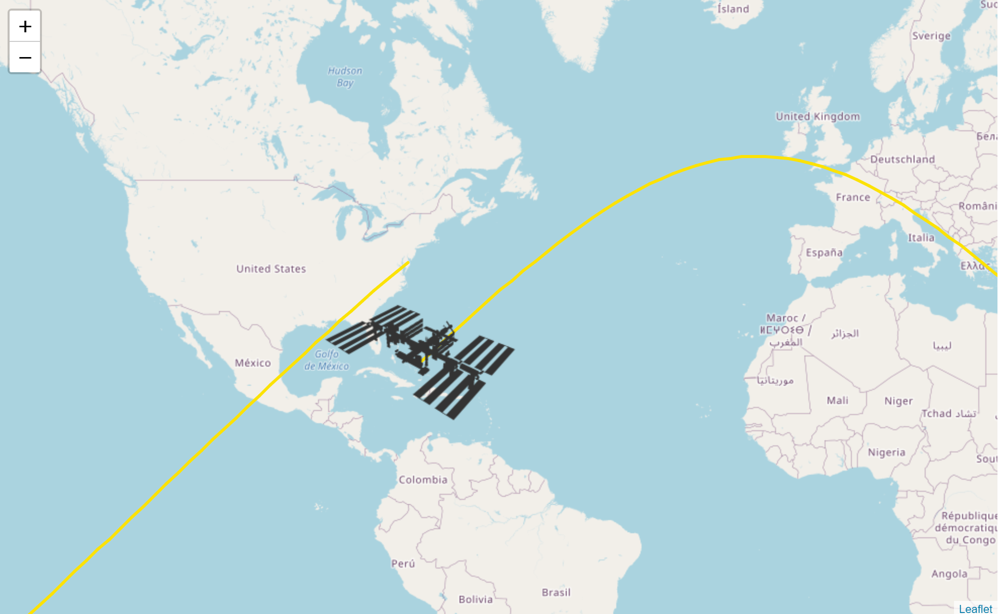

# Where is the ISS?
A website to track the ground position of the Internation Space Station.
I used the ["Where the ISS at?"](https://wheretheiss.at) API and [mappa.js](https://mappa.js.org/).  

# Author
Hunter Wilkins
## Contact me!
- <https://hunterwilkins.dev>
- <hunter.wilkins2@gmail.com>